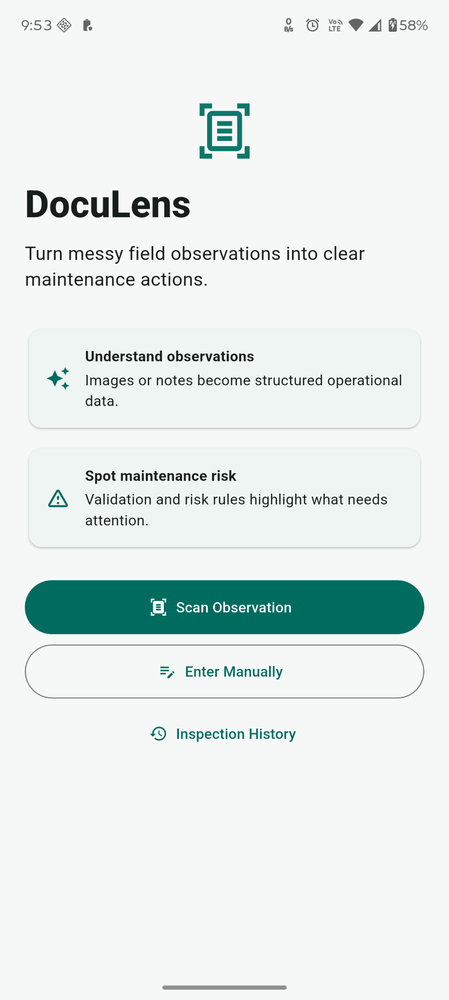

# DocuLens

> **Turn messy field observations into clear maintenance actions.**

DocuLens is a mobile-first field inspection assistant that converts **handwritten notes, images, or manual observations** into structured inspection data, identifies maintenance risks, and helps create actionable maintenance tasks.

## USP

Unlike a basic OCR/document scanner, DocuLens focuses on **understanding the operational meaning** of messy field observations — including handwriting, abbreviations, incomplete notes, measurements, and informal descriptions — and turning them into **validated maintenance actions**.

**Observation → Understanding → Validation → Risk → Action → Task**

## Current Prototype

The current prototype uses **Google Gemini** for multimodal understanding and structured extraction. This is being used because the project is currently a hackathon prototype and we want to demonstrate the complete workflow reliably.

> **Future:** We plan to integrate an **on-device/local LLM** for offline and privacy-focused processing.

## Core Features

- 📷 Capture handwritten observations using camera or gallery
- ✍️ Enter observations manually
- 🧠 Convert unstructured input into structured inspection data
- ⚠️ Detect risks and abnormal conditions
- 🔧 Generate recommended maintenance actions
- 📋 Create maintenance tasks
- 🗂️ View inspection and task history

## Visual Demo

The screenshots below show the current working prototype, including the home screen, observation input, inspection results, maintenance tasks, and history.

<p align="center">
  
</p>

<p align="center">
  <em>DocuLens home screen — entry point for field observation analysis.</em>
</p>

See the complete prototype walkthrough in [`docs/screenshots/`](docs/screenshots/).

## Tech Stack

- **Frontend:** Flutter / Dart
- **Backend:** Python / FastAPI / Pydantic
- **AI:** Google Gemini API
- **Database & Services:** Supabase
- **Communication:** REST API

## Project Structure

```text
DocuLens/
├── frontend/          # Flutter mobile application
├── backend/           # FastAPI backend and AI/validation services
├── docs/
│   ├── screenshots/   # Prototype screenshots and workflow reference
│   ├── ARCHITECTURE.md
│   ├── PRODUCT_SPEC.md
│   └── SCHEMA.md
└── README.md
```

## Getting Started

### Prerequisites

- Flutter SDK
- Python 3.x
- Git

### Backend

```bash
cd backend
python -m venv .venv
```

Windows PowerShell:

```powershell
.venv\Scripts\Activate.ps1
pip install -r requirements.txt
Copy-Item .env.example .env
uvicorn app.main:app --reload --port 8000
```

Add the required API/service configuration to `backend/.env`.

### Frontend

Open another terminal:

```bash
cd frontend
flutter pub get
flutter run
```

For Android, ensure your device/emulator is available with:

```bash
flutter devices
```

## Documentation

Detailed technical information is intentionally kept in the `docs/` folder:

- `docs/ARCHITECTURE.md` — system architecture and API design
- `docs/PRODUCT_SPEC.md` — product scope and requirements
- `docs/SCHEMA.md` — canonical data schema and validation rules
- `docs/screenshots/` — complete visual reference of the current prototype

## Security

Never commit secrets. Keep API keys and service credentials in `backend/.env`. The `.gitignore` is configured to exclude environment files.

## Status

**Hackathon prototype — core workflow implemented.**

The project currently demonstrates:

**Capture → AI understanding → Structured inspection → Risk assessment → Maintenance task → History**

## License

This project is provided for demonstration and hackathon purposes.
