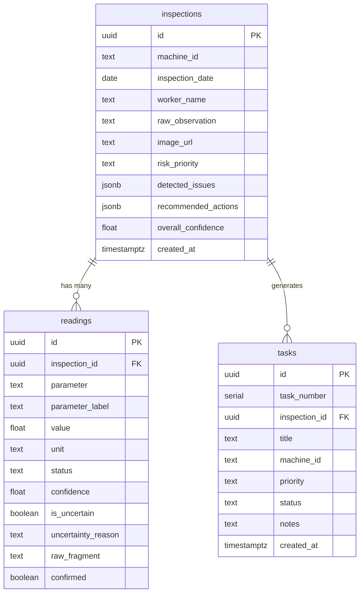

# DocuLens — Technical Architecture

## 1. System Overview

```
┌─────────────────────────────────────────────────────────────────┐
│                        DOCULENS MVP                             │
│                                                                 │
│  ┌──────────────┐     ┌──────────────────┐     ┌─────────────┐  │
│  │   Flutter     │     │   FastAPI        │     │  Supabase   │  │
│  │   Android App │────▶│   Backend        │────▶│  PostgreSQL │  │
│  │              │◀────│                  │◀────│             │  │
│  └──────────────┘     │  ┌────────────┐  │     └─────────────┘  │
│                       │  │ Gemini API │  │                      │
│                       │  │ (server)   │  │                      │
│                       │  └────────────┘  │                      │
│                       │  ┌────────────┐  │                      │
│                       │  │ Validation │  │                      │
│                       │  │ & Risk     │  │                      │
│                       │  └────────────┘  │                      │
│                       └──────────────────┘                      │
└─────────────────────────────────────────────────────────────────┘
```

### Data Flow

```
Image/Text ──▶ FastAPI ──▶ Gemini API ──▶ Structured JSON
                                              │
                                              ▼
                                      Validation Engine
                                              │
                                              ▼
                                       Risk Detection
                                              │
                                              ▼
                                    Action Recommendation
                                              │
                                              ▼
                                      Supabase (persist)
                                              │
                                              ▼
                                    Response to Flutter
```

### Team Responsibilities (3-person split)

| Person | Responsibility                              |
|--------|---------------------------------------------|
| Dev 1  | Flutter UI — screens, navigation, camera     |
| Dev 2  | FastAPI backend — API, Gemini, validation    |
| Dev 3  | Supabase schema, integration, testing, demo data |

---

## 2. Technology Stack

| Layer     | Technology          | Version    | Purpose                           |
|-----------|---------------------|------------|-----------------------------------|
| Frontend  | Flutter             | 3.47.x     | Android mobile app                |
| Backend   | Python + FastAPI    | 3.14 / 0.115+ | REST API server               |
| AI        | Google Gemini API   | gemini-2.5-flash | Multimodal extraction       |
| Database  | Supabase PostgreSQL | —          | Persistent storage                |
| HTTP      | Dio (Flutter)       | latest     | HTTP client                       |
| Imaging   | image_picker        | latest     | Camera/gallery capture            |
| Serialization | Pydantic (Python) | v2       | Request/response validation       |

---

## 3. API Contracts (Flutter ↔ FastAPI)

### Base URL

```
http://<backend-host>:8000/api/v1
```

### 3.1 `POST /api/v1/inspect`

Submit a field observation for AI extraction.

**Request** (`multipart/form-data`):

| Field       | Type             | Required | Description                       |
|-------------|------------------|----------|-----------------------------------|
| `image`     | File (image/*)   | No*      | Photograph of handwritten note    |
| `text`      | String           | No*      | Manual text input                 |

> \* At least one of `image` or `text` must be provided.

**Response** (`200 OK`) — shape defined by `InspectionResponse` in [SCHEMA.md](file:///c:/Users/rosha/Documents/Projects/DocuLens/docs/SCHEMA.md):

```json
{
  "inspection_id": "uuid",
  "machine_id": "M104",
  "inspection_date": null,
  "worker_name": null,
  "readings": [
    {
      "id": "uuid",
      "parameter": "temperature",
      "parameter_label": null,
      "value": 82,
      "unit": "°C",
      "status": "NORMAL",
      "confidence": 0.92,
      "is_uncertain": false,
      "uncertainty_reason": null,
      "raw_fragment": "temp 82",
      "confirmed": false
    },
    {
      "id": "uuid",
      "parameter": "vibration",
      "parameter_label": null,
      "value": null,
      "unit": null,
      "status": "HIGH",
      "confidence": 0.94,
      "is_uncertain": false,
      "uncertainty_reason": null,
      "raw_fragment": "vib high",
      "confirmed": false
    }
  ],
  "detected_issues": [
    {
      "description": "High vibration detected on M104",
      "severity": "HIGH",
      "source_readings": ["vibration"],
      "confidence": 0.94
    }
  ],
  "recommended_actions": [
    {
      "action": "Inspect M104 for vibration source.",
      "priority": "HIGH",
      "related_issues": ["High vibration detected on M104"]
    }
  ],
  "risk_priority": "HIGH",
  "next_inspection": "next week",
  "raw_observation": "M104 checked today. temp 82, vib high. oil ok. filter needs changing. check again next week.",
  "metadata": {
    "overall_confidence": 0.925,
    "field_count": 4,
    "uncertain_field_count": 0,
    "extraction_notes": null
  },
  "warnings": [],
  "created_at": "2026-08-27T12:00:00Z"
}
```

**Error responses**:

| Status | Body                                          |
|--------|-----------------------------------------------|
| 400    | `{ "error": "NO_INPUT", "message": "..." }`   |
| 422    | `{ "error": "AI_EXTRACTION_FAILED", "message": "..." }` |
| 500    | `{ "error": "INTERNAL_ERROR", "message": "..." }` |

---

### 3.2 `POST /api/v1/inspect/{inspection_id}/confirm`

User confirms or corrects extracted readings before creating a task.

**Request** (`application/json`):

```json
{
  "readings": [
    {
      "parameter": "temperature",
      "value": 82,
      "unit": "°C",
      "status": "NORMAL",
      "confirmed": true
    }
  ]
}
```

**Response** (`200 OK`):

```json
{
  "inspection_id": "uuid",
  "status": "confirmed"
}
```

---

### 3.3 `POST /api/v1/tasks`

Create a maintenance task from a confirmed inspection.

**Request** (`application/json`):

```json
{
  "inspection_id": "uuid",
  "title": "Replace filter on M104",
  "machine_id": "M104",
  "priority": "HIGH",
  "notes": "Optional additional notes"
}
```

**Response** (`201 Created`):

```json
{
  "task_id": "uuid",
  "task_number": 1,
  "title": "Replace filter on M104",
  "machine_id": "M104",
  "priority": "HIGH",
  "status": "OPEN",
  "created_at": "2026-08-27T12:05:00Z",
  "inspection_id": "uuid"
}
```

---

### 3.4 `GET /api/v1/tasks`

List all maintenance tasks.

**Query parameters**:

| Param     | Type   | Default | Description              |
|-----------|--------|---------|--------------------------|
| `status`  | String | —       | Filter: OPEN, CLOSED     |
| `priority`| String | —       | Filter: LOW, MEDIUM, HIGH|

**Response** (`200 OK`):

```json
{
  "tasks": [ /* array of task objects */ ],
  "count": 5
}
```

---

### 3.5 `PATCH /api/v1/tasks/{task_id}`

Update a task's status.

**Request** (`application/json`):

```json
{
  "status": "CLOSED"
}
```

**Response** (`200 OK`): Updated task object.

---

### 3.6 `GET /api/v1/inspections`

List inspection history.

**Query parameters**:

| Param        | Type   | Default | Description          |
|--------------|--------|---------|----------------------|
| `machine_id` | String | —       | Filter by machine    |
| `limit`      | Int    | 20      | Results per page     |
| `offset`     | Int    | 0       | Pagination offset    |

**Response** (`200 OK`):

```json
{
  "inspections": [ /* array of inspection result objects */ ],
  "count": 12,
  "total": 42
}
```

---

### 3.7 `GET /api/v1/inspections/{inspection_id}`

Get a single inspection with full detail.

**Response** (`200 OK`): Full inspection object (same shape as `POST /inspect` response).

---

### 3.8 `GET /api/v1/health`

Health check endpoint.

**Response** (`200 OK`):

```json
{ "status": "ok", "version": "0.1.0" }
```

---

## 4. AI Extraction Layer — Gemini Integration

> [!NOTE]
> The **canonical JSON schema**, Pydantic models, examples, and validation rules are defined in [SCHEMA.md](file:///c:/Users/rosha/Documents/Projects/DocuLens/docs/SCHEMA.md). This section covers integration strategy only.

### 4.1 Gemini Prompt Strategy

The backend sends a **system prompt** and the user's input (image and/or text) to `gemini-2.5-flash`, requesting **structured JSON output** via `response_mime_type="application/json"` and `response_schema`.

**System prompt summary** (full prompt in `backend/app/prompts/extraction_prompt.py`):

1. Extract machine ID, worker name, inspection date, measurements, conditions
2. Normalize to standard parameter names and status enums
3. Assign confidence scores (0.0–1.0) per reading
4. Flag uncertain values with `is_uncertain: true` and a reason
5. **NEVER** invent information not present in the input
6. Preserve original text fragments alongside each extraction
7. Detect issues and recommend actions based only on extracted data

### 4.2 Retry Strategy

- On Gemini failure: retry once after 1-second delay
- On second failure: return `AI_EXTRACTION_FAILED` with raw text so the user can retry
- On rate limit (429): return `AI_RATE_LIMITED` with retry-after hint

---

## 5. Validation & Risk Engine

The validation and risk engine is a **deterministic, rules-based** Python module that runs **after** Gemini extraction. It does **not** use the LLM.

> Full validation rules, range tables, risk weights, cross-field checks, and the complete pipeline are defined in [SCHEMA.md § 5](file:///c:/Users/rosha/Documents/Projects/DocuLens/docs/SCHEMA.md).

### Summary

| Stage                  | Purpose                                              |
|------------------------|------------------------------------------------------|
| Range validation       | Flag physically implausible numeric values            |
| Confidence thresholds  | Auto-flag readings with confidence < 0.7 as uncertain |
| Cross-field checks     | Detect inconsistencies (e.g., high temp + normal vib) |
| Risk scoring           | Weighted score → priority: LOW / MEDIUM / HIGH / CRITICAL |
| Action recommendation  | Template-based actionable recommendations             |
| Metadata update        | Recalculate overall confidence and uncertain counts   |

---

## 6. Supabase Database Schema

### 6.1 Tables

#### `inspections`

| Column                | Type         | Constraints          | Description                          |
|-----------------------|-------------|----------------------|--------------------------------------|
| `id`                  | UUID        | PK, default gen      | Inspection ID                        |
| `machine_id`          | TEXT        | nullable             | Extracted machine identifier         |
| `inspection_date`     | DATE        | nullable             | Extracted inspection date            |
| `worker_name`         | TEXT        | nullable             | Inspector name if mentioned          |
| `raw_observation`     | TEXT        | nullable             | Full OCR/input text                  |
| `image_url`           | TEXT        | nullable             | Supabase Storage URL if image        |
| `next_inspection`     | TEXT        | nullable             | Free-text next inspection schedule   |
| `risk_priority`       | TEXT        | NOT NULL             | LOW / MEDIUM / HIGH / CRITICAL       |
| `detected_issues`     | JSONB       | default '[]'         | Array of DetectedIssue objects       |
| `recommended_actions` | JSONB       | default '[]'         | Array of RecommendedAction objects   |
| `warnings`            | JSONB       | default '[]'         | Array of ValidationWarning objects   |
| `overall_confidence`  | FLOAT       | default 0.0          | Weighted average confidence          |
| `uncertain_field_count`| INT        | default 0            | Count of uncertain readings          |
| `extraction_notes`    | TEXT        | nullable             | AI extraction process notes          |
| `created_at`          | TIMESTAMPTZ | default now()        | Creation timestamp                   |

#### `readings`

| Column              | Type    | Constraints            | Description                      |
|---------------------|---------|------------------------|----------------------------------|
| `id`                | UUID    | PK, default gen        | Reading ID                       |
| `inspection_id`     | UUID    | FK → inspections.id    | Parent inspection                |
| `parameter`         | TEXT    | NOT NULL               | temperature, vibration, etc.     |
| `parameter_label`   | TEXT    | nullable               | Label when parameter is 'other'  |
| `value`             | FLOAT   | nullable               | Numeric value if applicable      |
| `unit`              | TEXT    | nullable               | °C, bar, etc.                    |
| `status`            | TEXT    | NOT NULL               | NORMAL, HIGH, CRITICAL, etc.     |
| `confidence`        | FLOAT   | NOT NULL               | 0.0–1.0                         |
| `is_uncertain`      | BOOLEAN | default false          | Flagged for user verification    |
| `uncertainty_reason`| TEXT    | nullable               | Why this value is uncertain      |
| `raw_fragment`      | TEXT    | NOT NULL               | Original text fragment           |
| `confirmed`         | BOOLEAN | default false          | User confirmed this reading      |

#### `tasks`

| Column          | Type         | Constraints            | Description                      |
|-----------------|-------------|------------------------|----------------------------------|
| `id`            | UUID        | PK, default gen        | Task ID                          |
| `task_number`   | SERIAL      | UNIQUE                 | Human-readable task number       |
| `inspection_id` | UUID        | FK → inspections.id    | Source inspection                |
| `title`         | TEXT        | NOT NULL               | Task title                       |
| `machine_id`    | TEXT        | nullable               | Machine identifier               |
| `priority`      | TEXT        | NOT NULL               | LOW / MEDIUM / HIGH / CRITICAL   |
| `status`        | TEXT        | NOT NULL, default OPEN | OPEN / IN_PROGRESS / CLOSED      |
| `notes`         | TEXT        | nullable               | Additional notes                 |
| `created_at`    | TIMESTAMPTZ | default now()          | Creation timestamp               |
| `updated_at`    | TIMESTAMPTZ | default now()          | Last update                      |

### 6.2 ER Diagram



### 6.3 SQL Migration

```sql
-- Enable UUID extension
CREATE EXTENSION IF NOT EXISTS "uuid-ossp";

CREATE TABLE inspections (
    id UUID PRIMARY KEY DEFAULT uuid_generate_v4(),
    machine_id TEXT,
    inspection_date DATE,
    worker_name TEXT,
    raw_observation TEXT,
    image_url TEXT,
    next_inspection TEXT,
    risk_priority TEXT NOT NULL DEFAULT 'LOW',
    detected_issues JSONB DEFAULT '[]'::jsonb,
    recommended_actions JSONB DEFAULT '[]'::jsonb,
    warnings JSONB DEFAULT '[]'::jsonb,
    overall_confidence DOUBLE PRECISION DEFAULT 0.0,
    uncertain_field_count INTEGER DEFAULT 0,
    extraction_notes TEXT,
    created_at TIMESTAMPTZ DEFAULT NOW()
);

CREATE TABLE readings (
    id UUID PRIMARY KEY DEFAULT uuid_generate_v4(),
    inspection_id UUID NOT NULL REFERENCES inspections(id) ON DELETE CASCADE,
    parameter TEXT NOT NULL,
    parameter_label TEXT,
    value DOUBLE PRECISION,
    unit TEXT,
    status TEXT NOT NULL DEFAULT 'UNKNOWN',
    confidence DOUBLE PRECISION NOT NULL DEFAULT 0.0,
    is_uncertain BOOLEAN DEFAULT FALSE,
    uncertainty_reason TEXT,
    raw_fragment TEXT NOT NULL,
    confirmed BOOLEAN DEFAULT FALSE
);

CREATE TABLE tasks (
    id UUID PRIMARY KEY DEFAULT uuid_generate_v4(),
    task_number SERIAL UNIQUE,
    inspection_id UUID REFERENCES inspections(id) ON DELETE SET NULL,
    title TEXT NOT NULL,
    machine_id TEXT,
    priority TEXT NOT NULL DEFAULT 'MEDIUM',
    status TEXT NOT NULL DEFAULT 'OPEN',
    notes TEXT,
    created_at TIMESTAMPTZ DEFAULT NOW(),
    updated_at TIMESTAMPTZ DEFAULT NOW()
);

-- Indexes for common queries
CREATE INDEX idx_inspections_machine_id ON inspections(machine_id);
CREATE INDEX idx_inspections_created_at ON inspections(created_at DESC);
CREATE INDEX idx_inspections_risk ON inspections(risk_priority);
CREATE INDEX idx_readings_inspection_id ON readings(inspection_id);
CREATE INDEX idx_readings_uncertain ON readings(is_uncertain) WHERE is_uncertain = TRUE;
CREATE INDEX idx_tasks_status ON tasks(status);
CREATE INDEX idx_tasks_priority ON tasks(priority);
```

---

## 7. Folder Structure

### 7.1 Backend (`backend/`)

```
backend/
├── app/
│   ├── __init__.py
│   ├── main.py                  # FastAPI app entry point
│   ├── config.py                # Settings (env vars, Gemini key, Supabase URL)
│   ├── models/
│   │   ├── __init__.py
│   │   ├── inspection.py        # Pydantic models for inspections & readings
│   │   └── task.py              # Pydantic models for tasks
│   ├── routers/
│   │   ├── __init__.py
│   │   ├── inspect.py           # POST /inspect, GET /inspections
│   │   ├── tasks.py             # CRUD for tasks
│   │   └── health.py            # GET /health
│   ├── services/
│   │   ├── __init__.py
│   │   ├── gemini_service.py    # Gemini API integration
│   │   ├── validation_service.py # Validation & risk engine
│   │   └── supabase_service.py  # Supabase client wrapper
│   └── prompts/
│       └── extraction_prompt.py # System prompt for Gemini
├── .env.example                 # Template for environment variables
├── .env                         # Local env (gitignored)
├── requirements.txt             # Python dependencies
└── README.md                    # Backend setup instructions
```

### 7.2 Frontend (`frontend/lib/`)

```
frontend/lib/
├── main.dart                    # App entry point, theme, routing
├── config/
│   ├── api_config.dart          # Backend base URL, timeouts
│   └── theme.dart               # App theme (colors, typography)
├── models/
│   ├── inspection.dart          # Inspection data model
│   ├── reading.dart             # Reading data model
│   └── task.dart                # Task data model
├── services/
│   ├── api_service.dart         # HTTP client (Dio) — all API calls
│   └── image_service.dart       # Camera/gallery image capture
├── screens/
│   ├── home_screen.dart         # Landing / dashboard
│   ├── capture_screen.dart      # Camera + text input screen
│   ├── results_screen.dart      # AI extraction results display
│   ├── task_create_screen.dart  # Create maintenance task
│   ├── task_list_screen.dart    # List all tasks
│   └── history_screen.dart      # Inspection history
└── widgets/
    ├── reading_card.dart        # Single reading display card
    ├── risk_badge.dart          # Priority/risk indicator
    ├── confidence_indicator.dart # Visual confidence display
    └── loading_overlay.dart     # AI processing animation
```

---

## 8. Error Handling Strategy

### 8.1 Backend Error Model

All errors return a consistent JSON shape:

```json
{
  "error": "ERROR_CODE",
  "message": "Human-readable description",
  "details": {}
}
```

### 8.2 Error Codes

| Code                    | HTTP | Meaning                                    |
|-------------------------|------|--------------------------------------------|
| `NO_INPUT`              | 400  | Neither image nor text was provided        |
| `INVALID_IMAGE`         | 400  | Image could not be read/decoded            |
| `AI_EXTRACTION_FAILED`  | 422  | Gemini returned invalid/no data            |
| `AI_RATE_LIMITED`       | 429  | Gemini API rate limit hit                  |
| `INSPECTION_NOT_FOUND`  | 404  | Inspection ID does not exist               |
| `TASK_NOT_FOUND`        | 404  | Task ID does not exist                     |
| `DB_ERROR`              | 500  | Supabase query failed                      |
| `INTERNAL_ERROR`        | 500  | Unhandled server error                     |

### 8.3 Backend Strategy

```python
# Global exception handler in FastAPI
@app.exception_handler(AppException)
async def app_exception_handler(request, exc):
    return JSONResponse(
        status_code=exc.status_code,
        content={"error": exc.error_code, "message": exc.message}
    )
```

- **Gemini failures**: Retry once. If still fails, return `AI_EXTRACTION_FAILED` with the raw text so the user can try again.
- **Supabase failures**: Log and return `DB_ERROR`. The API response still returns the AI result so the user sees their data (even if persistence failed).
- **Validation**: Never blocks the response. Warnings are returned alongside results.

### 8.4 Frontend Strategy

- Show a **snackbar** for transient errors (network timeout, rate limit).
- Show a **full-screen error** with retry button for critical failures (no network).
- Show **inline warnings** on individual readings for low-confidence values.
- **Timeout**: 30-second timeout for the `/inspect` endpoint (Gemini can be slow on images).

---

## 9. Key Design Decisions

| Decision | Choice | Rationale |
|----------|--------|-----------|
| Gemini model | `gemini-2.5-flash` | Fast, cheap, multimodal, structured output support |
| Validation engine | Deterministic rules (not LLM) | Reliable, fast, no extra API cost |
| Image storage | Supabase Storage | Already using Supabase, simple SDK |
| State management (Flutter) | `setState` + service classes | Simplest for MVP, no extra packages |
| API versioning | `/api/v1/` prefix | Clean separation for future changes |
| Task numbering | PostgreSQL SERIAL | Auto-incrementing, human-readable |
| Confidence threshold | 0.7 | Below this = flag for user confirmation |

---

## 10. Environment Variables

```env
# Backend .env
GEMINI_API_KEY=your-gemini-api-key
SUPABASE_URL=https://your-project.supabase.co
SUPABASE_KEY=your-supabase-anon-key
SUPABASE_SERVICE_KEY=your-supabase-service-role-key
HOST=0.0.0.0
PORT=8000
```

```dart
// Frontend — api_config.dart
// For Android emulator, 10.0.2.2 maps to host localhost
const String baseUrl = 'http://10.0.2.2:8000/api/v1';
const int timeoutSeconds = 30;
```
